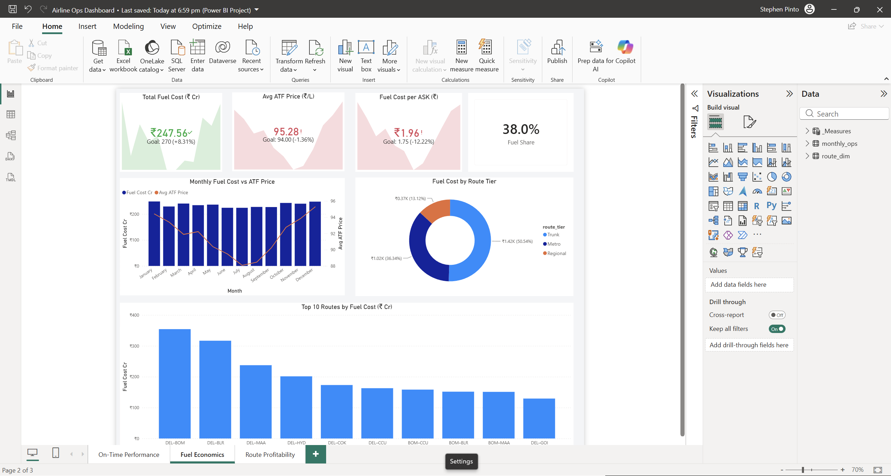
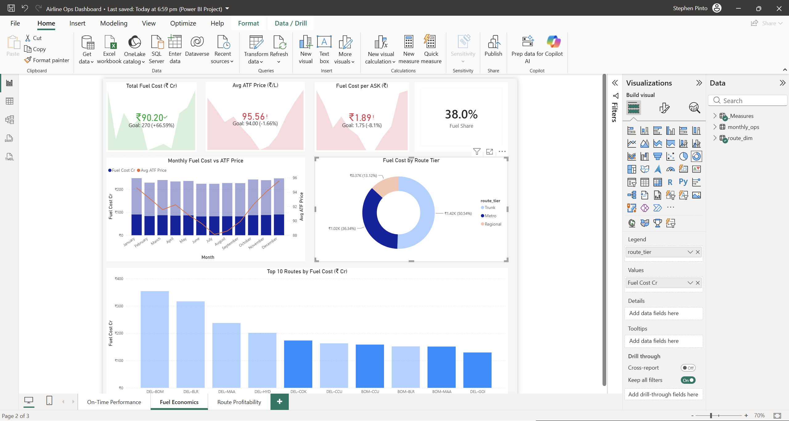

# Airline Operations

## Business question

How on time performance, load factor, and fuel cost drive route level profitability. The model lets an operations team see which routes earn their seat kilometres once fuel and total cost are allocated.

## Key metrics and DAX

`RASK-CASK Spread` and `Avg Load Factor` are the headline route economics. The spread is revenue per available seat kilometre minus cost per available seat kilometre, so it reads directly as the margin earned on each seat km. Load factor sits next to it, because a healthy spread on a poorly filled aircraft still leaves money on the table. The spread builds on `RASK` and `CASK`, both of which divide a rupee total by available seat kilometres.

```dax
RASK-CASK Spread =
    [RASK] - [CASK]
```

```dax
Avg Load Factor =
    AVERAGE(monthly_ops[avg_load_factor])
```

## Data model

The Power BI model is a star schema with one monthly operations fact joined to a route dimension.

| Table | Role | Grain | Key columns |
|---|---|---|---|
| `monthly_ops` | fact | one row per route per month | `scheduled_flights`, `operated_flights`, `on_time_flights`, `avg_load_factor`, `revenue_inr`, `fuel_cost_inr`, `total_op_cost_inr`, `operating_profit_inr`, `available_seat_km`, `revenue_pax_km` |
| `route_dim` | dimension | one row per route | `route_label`, `origin_city`, `dest_city`, `distance_km`, `route_tier`, `aircraft_type` |


## Measures catalog

| Measure | Display folder | Business definition |
|---|---|---|
| `Scheduled Flights` | Reliability | Flights scheduled, summed across routes and months. |
| `Operated Flights` | Reliability | Flights operated. |
| `Cancelled Flights` | Reliability | Flights cancelled. |
| `On-Time Flights` | Reliability | Flights that departed on time. |
| `OTP Rate` | Reliability | On time flights over operated flights. |
| `Cancellation Rate` | Reliability | Cancelled flights over scheduled flights. |
| `Avg Delay Minutes` | Reliability | Passenger weighted average delay across the delay buckets. |
| `Avg Load Factor` | Capacity & Demand | Average seat occupancy across the selection. |
| `RASK` | Capacity & Demand | Revenue per available seat kilometre. |
| `CASK` | Capacity & Demand | Operating cost per available seat kilometre. |
| `RASK-CASK Spread` | Capacity & Demand | Revenue per seat km minus cost per seat km, the unit margin. |
| `Fuel Cost Cr` | Fuel | Fuel cost expressed in crore rupees. |
| `Fuel Share of Op Cost` | Fuel | Fuel cost as a share of total operating cost. |
| `Weighted Avg ATF Price` | Fuel | Fuel cost over litres consumed, a spend weighted price. |
| `Avg ATF Price` | Fuel | Average posted fuel price. |
| `Fuel Per ASK` | Fuel | Fuel cost per available seat kilometre. |
| `Total Revenue Cr` | Profitability | Revenue expressed in crore rupees. |
| `Operating Profit (Cr)` | Profitability | Operating profit expressed in crore rupees. |
| `Profit Margin` | Profitability | Operating profit over revenue. |
| Target measures | Targets | Constant goal lines used in KPI visuals. |

## Key insights

Three short haul routes show strong load factors, yet thin margins once fuel cost is allocated, so a full aircraft does not by itself signal a profitable route. Fuel is the swing cost, and its share of operating cost separates the routes that hold margin from those that do not.

## Data source

The data folder holds a synthetic sample extract as CSV, one file for the operations fact and one for the route dimension, with all rupee figures in INR. All data is synthetic, no confidential airline data is committed.

## Screenshots




