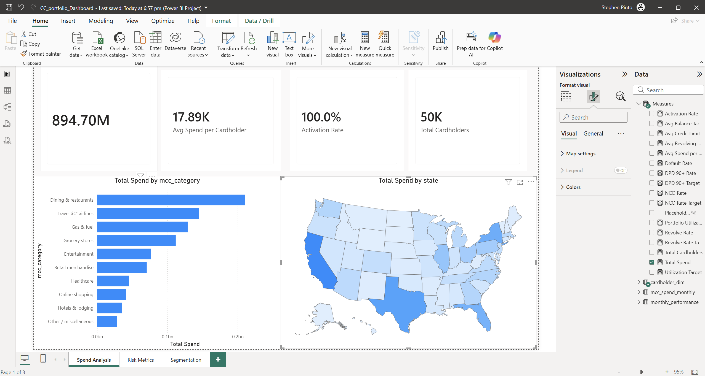
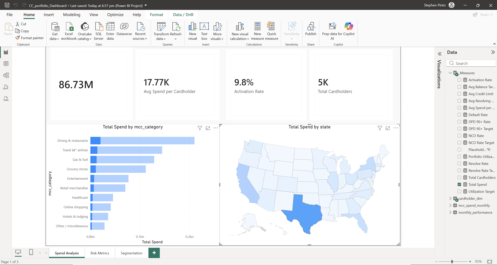

# Credit Card Portfolio

## Business question

How revolving balances, charge offs, and delinquency vary across customer segments, age bands, and geographies. The model lets a risk team read loss rates, utilization, and spend for any segment in one place.

## Key metrics and DAX

The two measures below carry the most modeling depth. `Total Receivables` is semi additive, so it sums balances across cardholders but never across months, it takes the last available month inside the current filter context. `Charge-Off Rate (Annualized)` expresses gross charge offs as an annualized share of period receivables, which is the loss rate a risk team actually tracks. It is labelled charge off rather than net, because the source data carries no recoveries.

```dax
Total Receivables =
    CALCULATE(
        SUM(monthly_performance[outstanding_balance]),
        LASTNONBLANK(
            monthly_performance[month],
            CALCULATE(SUM(monthly_performance[outstanding_balance]))
        )
    )
```

```dax
Charge-Off Rate (Annualized) =
    DIVIDE(
        SUM(monthly_performance[charge_off_amount]) * 12,
        SUM(monthly_performance[outstanding_balance])
    )
```

## Data model

The Power BI model is a star schema with one monthly performance fact, one monthly spend fact, and a cardholder dimension.

| Table | Role | Grain | Key columns |
|---|---|---|---|
| `monthly_performance` | fact | one row per cardholder per month | `outstanding_balance`, `payment_amount`, `revolve_flag`, `charge_off_flag`, `charge_off_amount`, `dpd_bucket` |
| `mcc_spend_monthly` | fact | one row per cardholder per month per merchant category | `spend_amount`, `mcc_category` |
| `cardholder_dim` | dimension | one row per cardholder | `segment`, `age_band`, `state`, `credit_limit`, `open_date` |

### Modeling notes

Receivables use a last snapshot, semi additive pattern, so balances are never summed across months and a portfolio total always reflects the latest month in context. The charge off rate is annualized against the period balance, so it reads as a comparable yearly loss rate regardless of how many months a slicer spans.

## Measures catalog

| Measure | Display folder | Business definition |
|---|---|---|
| `Total Spend` | Spend | Total card spend across all merchant categories. |
| `Avg Spend per Cardholder` | Spend | Spend divided by the count of distinct cardholders who transacted. |
| `Active Cards` | Spend | Distinct count of cardholders with spend in the period. |
| `Activation Rate` | Spend | Spending cardholders as a share of total cardholders, responsive to slicers. |
| `Total Receivables` | Receivables & Utilization | Outstanding balance at the last month in context, semi additive. |
| `Avg Revolving Balance` | Receivables & Utilization | Average outstanding balance across accounts that revolve. |
| `Portfolio Utilization` | Receivables & Utilization | Average outstanding balance over average credit limit. |
| `Avg Credit Limit` | Receivables & Utilization | Average assigned credit limit across cardholders. |
| `Revolve Rate` | Risk & Delinquency | Share of account months that carry a revolving balance. |
| `Charge-Off Rate (Annualized)` | Risk & Delinquency | Annualized gross charge off amount over average receivables. |
| `Default Rate` | Risk & Delinquency | Share of account months in default, sliceable by age band. |
| `DPD 30+ Rate` | Risk & Delinquency | Share of account months 30 or more days past due. |
| `DPD 60+ Rate` | Risk & Delinquency | Share of account months 60 or more days past due. |
| `DPD 90+ Rate` | Risk & Delinquency | Share of account months 90 or more days past due. |
| `Total Cardholders` | Portfolio | Distinct count of cardholders in the dimension. |
| `Revolve Rate Target`, `NCO Rate Target`, `DPD 90+ Target`, `Avg Balance Target`, `Utilization Target` | Targets | Constant goal lines used in KPI visuals. |

## Key insights

The youngest age band carries both the highest revolving rate and the steepest charge off rate, so growth in that band raises portfolio loss even as it lifts balances. Utilization and delinquency move together across segments, which lets the dashboard flag stress early from the utilization trend alone.

## Data source

The data folder holds a synthetic sample extract as CSV, one file per model table, ready to load into the star schema. All data is synthetic, no confidential portfolio data is committed.

## Screenshots




