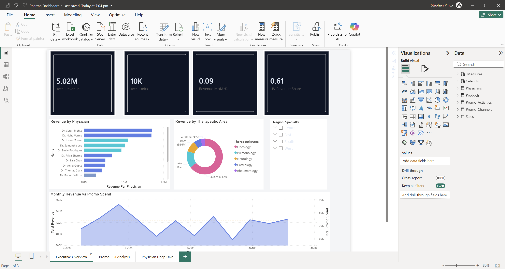
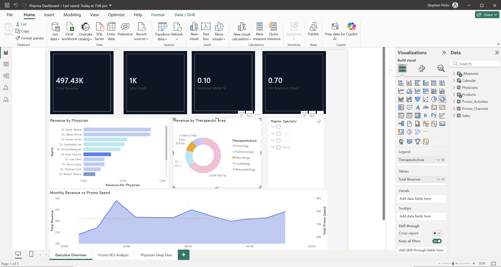

# Pharma Promotion ROI

## Business question

How promotional spend converts into attributed sales across channels and physician segments. The model lets a commercial team see where each promotional rupee earns its return, by channel and by prescriber decile.

## Key metrics and DAX

The two measures below carry the most modeling depth. `Channel ROI %` is built on attributed revenue rather than raw sales, so it credits promotion only with the revenue the attribution model assigns to it, net of spend. `Share of Voice %` compares brand reach against the synthetic market benchmark, so it frames promotional presence as a minority share of the wider channel rather than an absolute count.

```dax
Channel ROI % =
    DIVIDE(
        [Total Attributed Revenue] - [Total Promo Spend],
        [Total Promo Spend]
    ) * 100
```

```dax
Share of Voice % =
    DIVIDE([Brand Reach], [Market Reach])
```

## Data model

The Power BI model is a star schema with a sales fact and a promotion activity fact, sharing physician, product, channel, and calendar dimensions.

| Table | Role | Grain | Key columns |
|---|---|---|---|
| `Sales` | fact | one row per sale | `Revenue`, `Units`, `PhysicianID`, `ProductID`, `Date`, `SalesRepID` |
| `Promo_Activities` | fact | one row per promotion activity | `Cost`, `AttributedRevenue`, `Reach`, `ROI_pct`, `ChannelID`, `PhysicianID`, `Date` |
| `Physicians` | dimension | one row per physician | `Name`, `Specialty`, `Region`, `Decile`, `Segment`, `TerritoryID` |
| `Products` | dimension | one row per product | `ProductName`, `TherapeuticArea`, `UnitPrice` |
| `Promo_Channels` | dimension | one row per channel | `ChannelName`, `ChannelType`, `AvgCostPerContact` |
| `Calendar` | date dimension | one row per day | `Date`, `Year`, `Month`, `MonthName`, `Quarter`, `YearMonth` |
| `Market_Benchmark` | synthetic benchmark | one row per channel per month | `ChannelID`, `Date`, `MarketReach` |

### Modeling notes

A single calendar date dimension drives both the sales fact and the promotion activity fact, so one date slicer filters every fact and time intelligence stays consistent across the model. The `Sales` and `Promo_Activities` date columns are converted to real dates in Power Query and both join `Calendar`.

`Market_Benchmark`, and therefore `Share of Voice %`, is SYNTHETIC. It is a benchmark generated inside the model for demonstration, it is not real market data. It exists so share of voice has a denominator, and it is seeded deterministically so brand reach lands at roughly 15 to 30 percent of the market, varying by channel and month. See the data dictionary in the data folder for how it is built. Treat it as an illustrative competitive baseline, never as sourced competitive data.

## Measures catalog

| Measure | Business definition |
|---|---|
| `Total Revenue` | Total sales revenue. |
| `Total Units` | Total units sold. |
| `AVG. Revenue` | Average revenue per sales record. |
| `Avg Unit Price` | Revenue over units. |
| `Active Physicians` | Distinct count of physicians with sales. |
| `Revenue Per Physician` | Revenue over active physicians. |
| `Total Promo Spend` | Total promotional cost. |
| `Total Attributed Revenue` | Revenue attributed to promotion. |
| `Channel ROI %` | Attributed revenue net of spend over spend, scaled to a percent. |
| `Avg Channel ROI %` | Average channel ROI across channels. |
| `ROI Tier` | High, medium, or low ROI band derived from channel ROI. |
| `Revenue Per Promo Dollar` | Attributed revenue over promotional spend. |
| `Promo Spend Per Physician` | Promotional spend over active physicians. |
| `Personal Calls` | Count of personal channel promotion activities. |
| `Sales per Call` | Revenue over the number of personal channel calls. |
| `Brand Reach` | Total brand reach from promotion activities. |
| `Market Reach` | Total market reach from the synthetic benchmark. |
| `Share of Voice %` | Brand reach as a share of synthetic market reach. |
| `Personal Channel ROI %` | ROI for personal channels. |
| `NonPersonal Channel ROI %` | ROI for non personal channels. |
| `Personal Promo Spend` | Spend on personal channels. |
| `NonPersonal Promo Spend` | Spend on non personal channels. |
| `HV Revenue Share` | High value segment revenue as a share of total revenue. |
| `Top 5 Physician Revenue` | Revenue from the top five physicians by revenue. |
| `Physician Revenue Rank` | Dense rank of physicians by revenue. |
| `Revenue MoM %` | Month over month revenue change using the calendar. |
| `Revenue YoY %` | Year over year revenue change using the calendar. |

## Key insights

Field calls outperform digital spend for high decile prescribers, the reverse holds for low decile ones, so the efficient channel mix shifts with prescriber value. Channel ROI read on attributed revenue keeps that comparison honest, since it credits promotion only with the revenue the attribution model assigns.

## Data source

The data folder holds `pharma_sales_promo_data.xlsx` with the sales and promotion records, and a `data_dictionary.md` describing every field. The calendar date dimension and the `Market_Benchmark` table are built inside the model. All data is synthetic, and the market benchmark in particular is generated for demonstration rather than sourced.

## Screenshots




